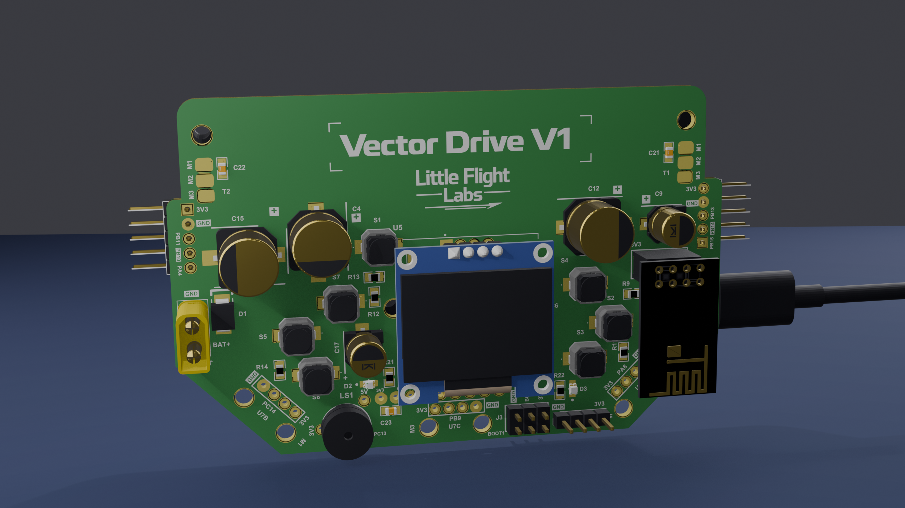
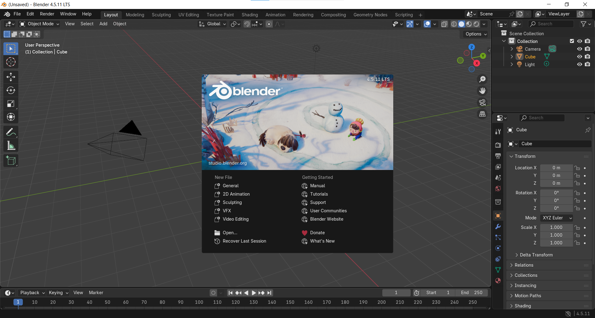
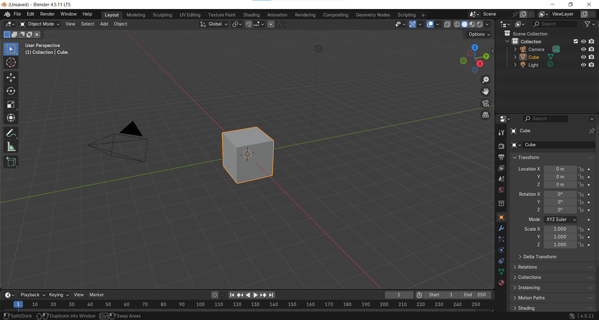
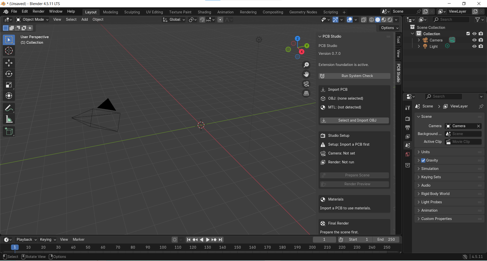
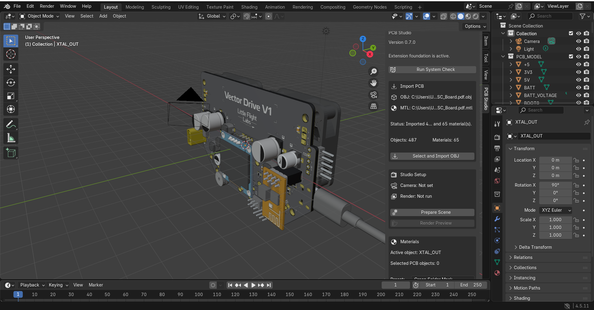
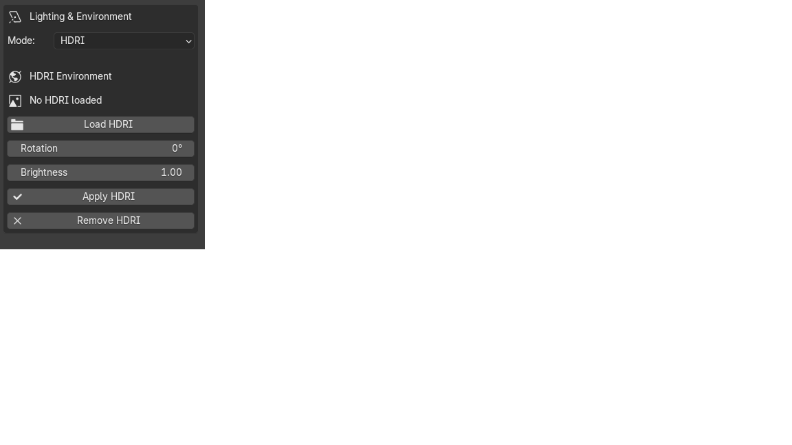
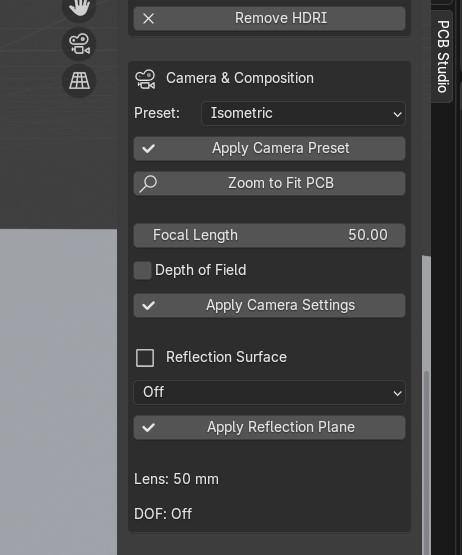

# PCB Studio

PCB Studio is a Blender extension for importing, preparing, rendering, and animating PCB models with a simple workflow.

The project is aimed at PCB designers, engineers, makers, and developers who want good-looking PCB renders without learning Blender in depth.

## Turntable Demo Video

See a sample PCB Studio turntable animation:

**[▶ Watch the PCB Turntable Demo](docs/videos/pcb_turntable.mp4)**

> Current tested environment: **Blender 4.5.11 LTS on Windows**



## Features

- Import PCB models from **OBJ**
- Automatically detect and use the linked **MTL** material file
- Automatic PCB scene preparation
- Automatic camera creation and framing
- Manual PCB material assignment
- PCB-oriented material presets
- Studio lighting presets
- HDRI environment lighting with rotation and brightness controls
- Background presets
- Camera presets including Top, Isometric, 45 Degree, Bottom, Close-up, and Macro
- Zoom-to-fit camera control
- Depth of Field
- Reflection surface
- Preview rendering
- Final still-image rendering and export
- PCB turntable animation
- 720p and 1080p video rendering
- Animation duration, FPS, direction, and rotation controls

---

## Download

The current tested build is:

**[Download `pcb_studioV9.zip`](Releases/pcb_studioV9.zip)**

Do **not** extract the ZIP before installing it in Blender.

---

## Requirements

- Blender **4.5.x LTS** recommended
- Windows is the primary tested platform
- OBJ PCB model
- MTL file when available
- EEVEE is recommended for faster rendering

No external Python packages are required by the Blender extension.

---

# Installation

## 1. Open Blender

Start Blender.



Click **General** to open the normal 3D workspace.



The default scene normally contains a Cube, Camera, and Light.

You may delete the default cube by selecting it and pressing `X`, but this is optional.

## 2. Install PCB Studio

In Blender, open:

`Edit → Preferences → Get Extensions`

Open the menu in the upper-right corner and choose:

`Install from Disk`

Select:

`pcb_studioV9.zip`

Enable **PCB Studio** if Blender asks you to enable it.

## 3. Open PCB Studio

Return to the 3D Viewport.

Move the mouse over the viewport and press:

`N`

The right sidebar will appear.

Select the **PCB Studio** tab.



Before a PCB is imported, several controls are disabled. This is normal.

---

# Preparing Your PCB File

## Altium Designer

The recommended workflow is to export the PCB as:

```text
MyBoard.obj
MyBoard.mtl
```

Keep both files in the same folder:

```text
PCB_Export/
├── MyBoard.obj
└── MyBoard.mtl
```

You only need to select the `.obj` file in PCB Studio.

The OBJ normally references the material library internally, for example:

```text
mtllib MyBoard.mtl
```

PCB Studio imports the OBJ and Blender loads the linked MTL materials automatically.

You do **not** need to select the MTL file separately.

## KiCad / STEP Users

PCB Studio currently expects an OBJ file.

If your PCB workflow gives you a STEP file instead, convert the STEP model to OBJ first using a tool such as:

- FreeCAD
- Fusion 360
- another CAD or mesh-conversion tool

A typical workflow is:

```text
KiCad / STEP
     ↓
FreeCAD / Fusion 360
     ↓
OBJ
     ↓
PCB Studio
```

Material and object separation can vary depending on the conversion tool.

---

# Basic Workflow

```text
Import PCB
    ↓
Prepare Scene
    ↓
Assign Materials
    ↓
Choose Lighting / HDRI
    ↓
Choose Background
    ↓
Choose Camera
    ↓
Preview Render
    ↓
Final Still Render
      or
Turntable Animation
```

---

# Importing the PCB

Click:

**Select and Import OBJ**

Choose the PCB `.obj` file.

PCB Studio will:

1. Read the OBJ file.
2. Detect the referenced MTL file when available.
3. Import the PCB geometry.
4. Load the available MTL materials.
5. Organize the imported PCB objects.
6. Report the number of imported objects and materials.



After a successful import, the remaining PCB Studio tools become available.

---

# Prepare the Scene

Click:

**Prepare Scene**

PCB Studio automatically prepares the rendering environment, including the managed PCB setup, camera, framing, lighting, background, and render configuration.

Then click:

**Render Preview**

to generate a quick preview.

If Blender looks temporarily unresponsive while rendering, wait for the render to finish. Rendering time depends on PCB complexity, render resolution, lighting, HDRI size, and hardware.

---

# Assigning Materials

Material assignment should be done in **Object Mode**.

Look at the mode selector in the upper-left corner of the 3D Viewport.

It should say:

`Object Mode`

If Blender is in Edit Mode, press:

`Tab`

to return to Object Mode.

Select a PCB object.

PCB Studio should show something similar to:

```text
Active object: ComponentBody.116
Selected PCB objects: 1
```


Choose a material preset and adjust the available controls.

Typical controls include:

- **Base Color** — visible material color
- **Metallic** — `0` for non-metals, approximately `1` for metals
- **Roughness** — lower values are shinier, higher values are more matte
- **Coat Weight** — additional coated/glossy appearance where supported

Possible PCB Studio material presets include solder mask, plastic, ceramic, copper, gold, tin/silver, and silkscreen materials.

Click:

**Create or Update Material**

then:

**Assign to Selected Objects**

To assign the same material to several PCB components, hold `Shift` while selecting multiple objects.

## Previewing Materials

Move the mouse over the 3D Viewport and press:

`Z`

Choose:

**Material Preview**

For a more accurate result using the configured lights and camera, use:

**Render Preview**

---

# Lighting & Environment

PCB Studio includes one-click studio lighting presets.

Typical presets include:

### Bright Studio

Clean, bright, low-contrast lighting for documentation and catalog-style images.

### Dark Studio

More dramatic lighting with stronger edge highlights and contrast.

### Product Shot

A balanced general-purpose commercial product look.

### PCB Showcase

Designed to emphasize PCB surfaces, metallic pads, connectors, component edges, and silkscreen.



Depending on the build, you can also adjust:

- Lighting Intensity
- Shadow Softness

---

# HDRI Lighting

PCB Studio can use HDRI environment lighting.

Supported formats include:

```text
.hdr
.exr
```

You can download HDRIs from sources such as Poly Haven.

For lower-end GPUs, start with **1K or 2K HDRIs**.

Select:

`Lighting Mode → HDRI`

Load your HDR or EXR file.

Then adjust:

- **HDRI Rotation** — changes the direction of the environment and reflections
- **HDRI Brightness** — changes environment intensity

HDRI rotation is useful for controlling reflections on metallic pads, pins, connectors, and solder-mask surfaces.

---

# Background Presets

PCB Studio provides several background options, depending on the current build.

Typical presets include:

- White
- Black
- Dark Gray
- Blue Gradient

The background can be changed independently from the lighting.

For example:

```text
PCB Showcase Lighting
+
Dark Gray Background
```

or:

```text
Bright Studio
+
White Background
```

---

# Camera & Composition

PCB Studio provides camera presets so you do not need to manually position the camera for every render.



Typical presets include:

### Top

Straight board overview.

Useful for documentation and layout presentation.

### Isometric

Three-quarter product view.

Recommended for general PCB renders.

### 45 Degree

Lower angle that shows more PCB thickness and component height.

### Bottom

Shows the underside of the PCB when underside geometry is present.

### Connector Closeup

1. Switch Blender to Object Mode.
2. Select one PCB component.
3. Choose **Connector Closeup**.
4. Apply the camera preset.

PCB Studio uses the selected object as the camera target.

### Macro

Select one PCB object and choose **Macro** for a tighter close-up.

Macro mode can be combined with Depth of Field.

---

# Zoom to Fit PCB

After changing camera direction or focal length, use:

**Zoom to Fit PCB**

PCB Studio adjusts camera distance so the PCB fits inside the frame while preserving the current camera direction.

---

# Camera Focal Length

Focal length changes the look of the shot.

Typical ranges:

```text
24–35 mm   Wide perspective
50–70 mm   General product photography
85–120 mm  Close-up / macro style
```

After changing focal length, use **Zoom to Fit PCB** if the board becomes cropped.

---

# Depth of Field

Depth of Field can keep one part of the PCB sharp while blurring the foreground or background.

Possible focus targets include:

- PCB Center
- Selected Object

Lower F-Stop values create stronger blur.

Examples:

```text
f/1.8 – f/2.8   Strong blur
f/4 – f/5.6     Moderate product-photo blur
f/8 and higher  More of the PCB remains sharp
```

For full-board renders, moderate values are usually easier to use.

---

# Reflection Surface

PCB Studio can create a managed reflection surface beneath the PCB.

Typical options include:

- Off
- Subtle
- Glossy

**Subtle** creates a softer product-table reflection.

**Glossy** creates a stronger reflection.

The reflection surface is separate from the PCB geometry.

---

# Rendering a Still Image

Before the final render:

```text
Check Materials
    ↓
Choose Lighting / HDRI
    ↓
Choose Background
    ↓
Choose Camera
    ↓
Render Preview
```

When the preview looks correct, select your output settings and run the final render.

PCB Studio can render and save the image automatically.


---

# Turntable Animation

PCB Studio can create a product-style rotating PCB animation.

The intended behavior is:

```text
Camera stays still
Lighting stays still
Background stays still
PCB rotates
```

This creates a commercial product-turntable effect.


Recommended full-board camera presets:

- Isometric
- 45 Degree

---

# Turntable Settings

## Direction

Choose:

- Clockwise
- Counter-Clockwise

## Rotation

Typical choices:

- 180°
- 360°
- 720°

For normal product videos, use:

`360°`

## Duration

Choose the animation length in seconds.

Examples:

- 4 seconds
- 6 seconds
- 8 seconds

## Frame Rate

Typical options include:

- 24 FPS
- 30 FPS
- 60 FPS

For LinkedIn and YouTube, **30 FPS** is a good default.

---

# Recommended Video Settings

## Fast Preview

```text
Resolution: 1280 × 720
FPS: 30
Duration: 4 seconds
Rotation: 360°
Engine: EEVEE
```

Use this first to verify that the animation, camera, materials, and lighting are correct.

## Final LinkedIn / YouTube Video

```text
Resolution: 1920 × 1080
FPS: 30
Duration: 6 seconds
Rotation: 360°
Output: MP4 / H.264
```

This provides a good balance between quality, file size, and render time.

---

# Preview Turntable

Click:

**Setup Turntable**

then:

**Preview Turntable**

This lets you inspect the rotation before rendering every frame.

If automatic playback does not start, press:

`Spacebar`

to preview the timeline animation.

---

# Render Test Frame

Before rendering the complete video, use:

**Render Test Frame**

This renders only one frame.

Check:

- Camera
- Lighting
- Materials
- HDRI
- Reflection
- Depth of Field
- Background

If the test frame looks correct, continue to the full animation.

---

# Render Turntable Video

Select the required video quality, output directory, and filename.

Then click:

**Render Turntable Video**

For slower computers, start with:

```text
720p
30 FPS
4 seconds
```

before trying 1080p.

Full animation rendering can take much longer than still-image rendering.

Blender may appear temporarily unresponsive during a long render. This does not necessarily mean Blender has crashed.

---

# Performance Tips

If rendering is slow:

- Use EEVEE.
- Start with 720p.
- Use 30 FPS instead of 60 FPS.
- Use 1K or 2K HDRIs while testing.
- Render one test frame before a full animation.
- Start with a 4-second turntable.
- Close unnecessary applications while rendering.
- Move to 1080p only after the scene has been verified.

---

# Troubleshooting

## PCB Studio tab is not visible

Make sure the extension is enabled.

Move the mouse over the 3D Viewport and press:

`N`

Then select the **PCB Studio** tab.

## MTL is not detected

Keep the OBJ and MTL files in the same folder.

Check that the OBJ references the correct MTL filename.

## Material assignment does not work

Make sure Blender is in **Object Mode**.

Select a valid PCB mesh object before assigning the material.

## Camera view looks wrong

Try another camera preset and use **Zoom to Fit PCB**.

You can also manually adjust Blender's camera after PCB Studio creates it.

## HDRI is slow

Use a 1K or 2K HDRI instead of a very high-resolution HDRI.

## Animation is very slow

Start with:

```text
1280 × 720
30 FPS
4 seconds
EEVEE
```

and only move to 1080p after the animation is working correctly.

---

# Known Limitations

PCB Studio is still an experimental project.

Current limitations may include:

- CAD programs can export OBJ geometry differently.
- Some imported MTL materials may need manual adjustment.
- KiCad STEP workflows currently require conversion to OBJ.
- Automatic component classification is not included.
- Material assignment is mainly manual.
- Very complex PCB models can take longer to import and render.
- High-resolution HDRIs use more GPU memory.
- 1080p animation can take significant time on older GPUs.
- Some camera compositions may still benefit from manual adjustment.

Always keep a copy of your original PCB export.

---

# Tested Environment

```text
Blender: 4.5.11 LTS
Operating System: Windows
Renderer: EEVEE
Primary Input: Altium Designer OBJ + MTL
```

Testing on other operating systems, Blender versions, and PCB export workflows is welcome.

---

# Feedback and Bug Reports

If you encounter a problem, open a GitHub Issue and include:

- PCB Studio version
- Blender version
- Operating system
- What you were doing when the problem occurred
- Screenshot of the problem
- Blender system-console traceback when available

Please do not upload proprietary PCB design files unless you have permission to share them.

---

# Project Status

PCB Studio is an experimental project under active development.

The goal is to make attractive PCB product renders and animations accessible to engineers and PCB designers without requiring deep Blender experience.

Feedback, testing, bug reports, and suggestions are welcome.
